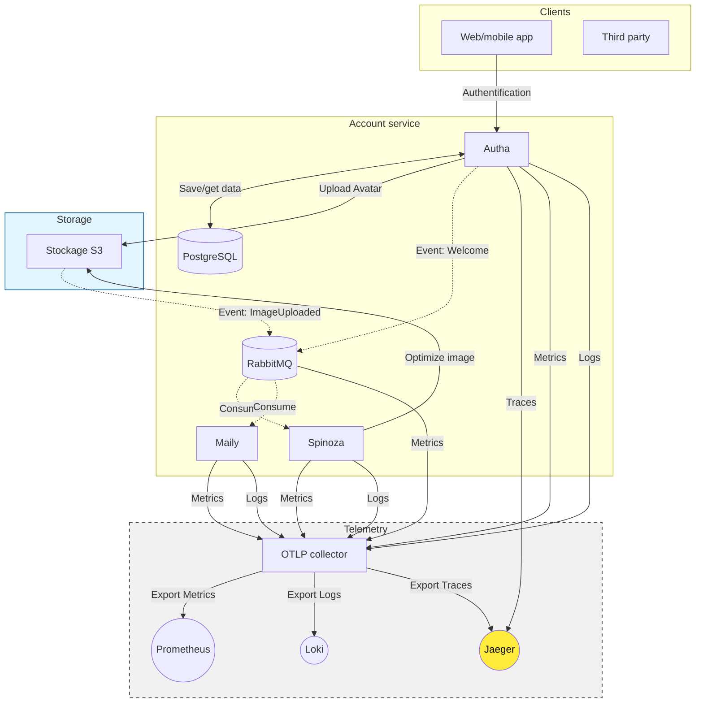
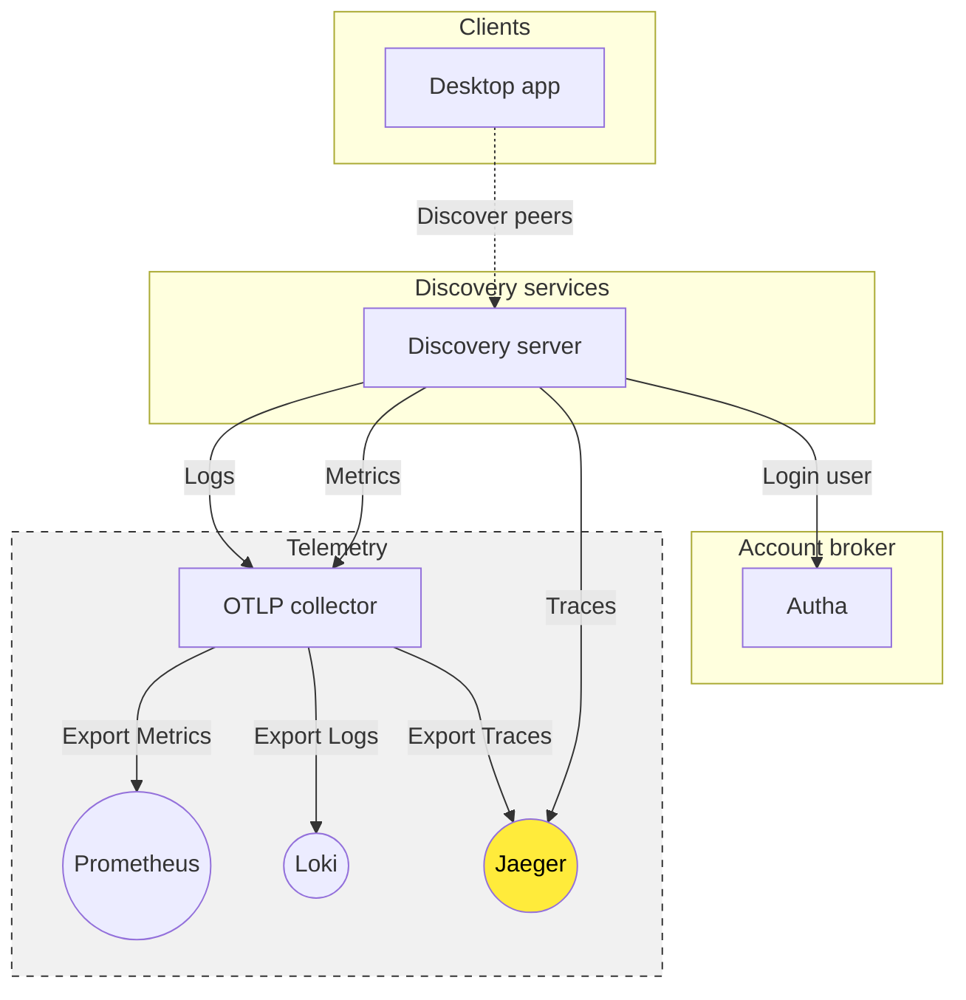

# Gravitalia Architecture

This page describe Gravitalia event-driven architecture in production.
Production is fairly modular, which means that users self-hosting Gravitalia
can choose to remove certain microservices.

Removing certain microservices saves memory and processor time, but also
reduces the ability to monitor services effectively. Gravitalia has chosen to
limit metric events in any case, to guarantee a certain amount of "no-log."

In production, services MUST NOT be exposed. A reverse proxy (e.g., nginx) must
 also be added, particularly to distribute load, rate limits, and cache some
 routes. Gravitalia uses a tunnel (like Cloudflare Tunnel) to avoid exposing
 any ports outside world.

Services are written in Rust or Elixir, depending on requirements. RabbitMQ
consumers MUST support backpressure, with a single retry on failure. Events
MUST use CloudEvents AMPQ specification \[[1](
https://github.com/cloudevents/spec/blob/main/cloudevents/bindings/amqp-protocol-binding.md)\].
## Account broker (Autha) architecture

## Gravitalia Turms

